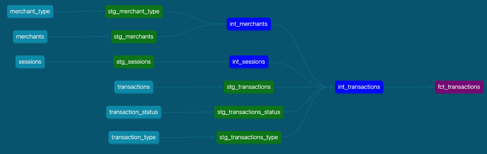
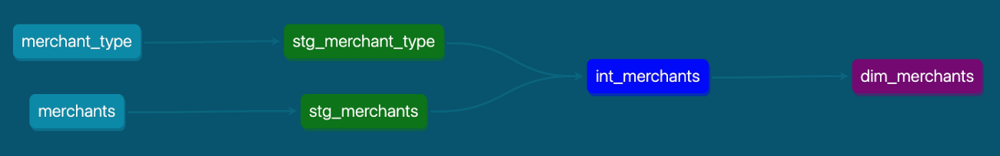
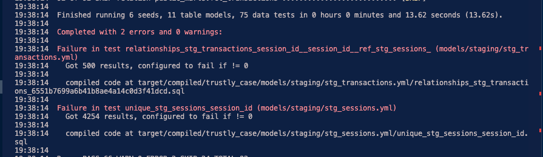

# Trustly Case

Project GitHub -> [link](https://github.com/AbnerHenriq/case-trustly/tree/main) 

## Stack:

Transformation: dbt
Database: PostgreSQL

# 1. Model It Your Way 

## Deliverables

The final models are `fct_transactions` and `dim_merchants` used to create all queries.

### Transactions


### Merchants:


#  Data Quality:

- I applied some tests to capture errors and apply transformations. Notable points include:
    - Removed test merchant rows (id = 3)
    - Identified 500 transactions without sessions. These transactions are assigned to session 0, which does not exist in the sessions.
    - Discovered duplicity in the session table, functioning more like session_steps than a session table.
    - Added custom tests to capture errors that could impact the architecture:
        - Checked for transactions with more than one session
        - Verified if a session has more than one bank



##  Questions

All questions can be found in the file [questions.md](dbt-trustly/questions/questions.md)


# 2 - Suggest It Your Way 

## Questions

> Objective: Assess the candidate's ability to suggest new tools and improvements for our architecture.
> Question: After creating the DataMart, automating the process is crucial to ensure regular updates and data accuracy. How would you automate the creation of your DataMart? Which tools and technologies would you use?

Answer: If only orchestrating SQL is needed, dbtCloud could be used in the pipeline. If there is also a need to send information from the datalake to production/CRM/external systems using Python, Airflow as the orchestrator for the entire pipeline is a great option. Additionally, I would add GitHub Actions to run automated tests and runs on pull requests, ensuring error capture before production.

> Objective: Evaluate the candidate's ability to implement efficient, incremental, and fast data processes, as well as think about new models and table optimizations.
> Question: You are responsible for creating a DataMart for the risk department in our company, which needs to be updated hourly. Full data loads are not a viable option due to data volume and performance impact. Considering that our transaction and session tables are fed via streaming and the merchant table is updated in batch, how would you implement incremental loading to ensure the DataMart is updated correctly and efficiently? Please describe your approach.

I see the need for some answers before suggesting a solution.
Firstly, I would try to understand if:
1. Is it possible to have a transaction in a merchant's base that has not yet been loaded?
2. What is the average time for this transaction to be linked to the merchant after loading?

With the query below, we can better understand the ingestion behavior of the base.
```sql
SELECT 
	t.merchant_id
	, dm.merchant_created_at AS merchant_load_created_at 
	, MIN(t.trans_created_at) AS transaction_created_at
	, EXTRACT(EPOCH FROM (MIN(t.trans_created_at) - dm.merchant_created_at)) / 3600 AS diff_hours
FROM public_marts.fct_transactions t
LEFT JOIN public_marts.dim_merchants dm
	ON dm.merchant_id = t.merchant_id 
WHERE t.trans_status_name = 'Completed'
GROUP BY 1, 2
ORDER BY diff_hours ASC
```

We cannot have a merchant base being updated D-1 or with high frequency, since transactions can be assigned up to 4 hours after the merchant load. 

Some options:
1. Study ways to update the merchant base more frequently
2. Store orphan transactions in staging
    - Do not bring these transactions to the marts, leaving only information that is already fully populated correctly
3. Bring this information to the mart, accepting that merchant information may be null initially.
    - Important here is to have monitoring jobs for these transactions without merchants, as they should be resolved within the next merchant load.
    - Reprocessing these transactions as soon as new information arrives (incremental surrogate key using merchants_ids or updated_at)
    - Documentation and communication with stakeholders about possible delay in merchant information.

> Objective: Assess the candidate's optimization skills, considering the chosen tool for storing and processing data. Encourage creativity and comprehensive thinking. 
> Question: You are responsible for creating a DataMart for the product department in our company, but the DataMart load is experiencing performance issues. What types of optimizations would you implement to improve the performance of the loading process? Consider the following areas in your response:
        ○ Query Performance
        ○ ETL Process Enhancement
        ○ Resource Management and Scaling


There are some options to be explored in each step:
1. Query Performance:
    - Use EXPLAIN ANALYZE to understand query behavior
        - Use SORKEYs and DISKEYs
    - Partition large tables
    - Indexing

2. ETL / DBT Process Enhancement:
    - Use incremental processing in dbt to process only new or changed data
        - Not only in dbt but also for any job where incremental processing is possible, whether it's loading, extraction, or transformation.
    - Materialized and aggregated tables
    - Fix lineage of transformations
        - Sometimes there are many redundancies in the dbt pipeline, with the same transformation being done multiple times
    - Check the possibility of parallelism with Spark - if it's within the Stack

3. Resource Management and Scaling:
    - Use result caching for frequent queries
    - Configure autoscaling to adjust capacity as needed
    - Check the actual need between having S3 and Redshift for data storage, possibly using only one tool

> Objective: Evaluate the candidate's approach to ensuring data quality, including new tools, tests, and processes.
Question: You need to ensure the quality of the data being processed and stored. What processes and practices would you implement to ensure the integrity, accuracy, and quality of the data in the DataMart? 

1. Documentation and testing with dbt:
    - All models, from all layers, should have unique and not_null tests, at least.
    - Tables and columns with excellent documentation
    - Use advanced testing libraries like dbt-expectation
    - Use custom tests and unit tests if necessary

2. Job Monitoring:
    - Alerts if dbt run, test, or freshness jobs fail
    - Alerts if ingestion jobs fail

2. Effective Processes:
    - Ensure that all failure alerts are viewed and acted upon by team members
    - Ensure that stakeholders impacted by routine failures are aware before using the data
    
3. Data Reconciliation:
    - Access and ready queries to validate between the datalake and the production/replica base, to verify data correctness

4. Data Handling
    - Handling null and inconsistent data
    - Handling duplicate data
    - Active communication with the production/data creators team to identify and address inconsistent data

5. Versioning
    - Controlled versioning of environment changes, whether tables, metrics, etc, through Git.
    - Detailed pull requests for colleagues to understand changes

6. Data Catalog
    - Data catalog tools to facilitate data, metrics, and model discovery
    
7. Metadata Dashboard
    - Visibility of important data quality metrics, such as:
        - User Activity
            - Total users
            - Users by type
            - Users over time
            - Weekly, monthly querying users
        - About users
            - Top dashboards builders
            - Top developers
            - Top users
            - Unengaged Users
        - Errors and Broken Context
            - Broken dashboards
            - Broken questions
        - Context Activity
            - Dashboards usage
            - Questions usage
            - Top dashboards
            - Unused Dashboards
            - Unused Explorer
            - Slow queries

8. Stakeholder Management and Feedback
    - Have an open channel to receive errors, feedback, and suggestions from stakeholders, and improve processes